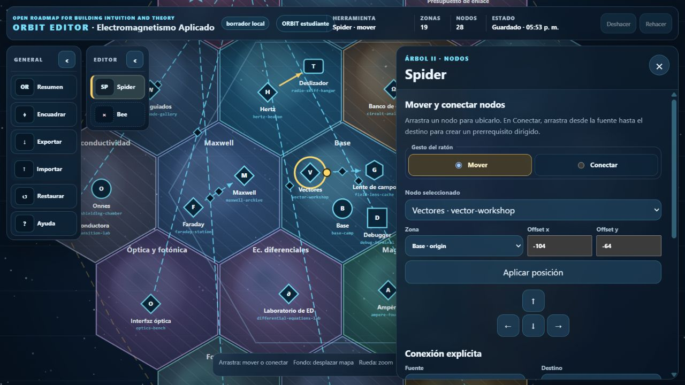

#  ORBIT

**Open Roadmap for Building Intuition and Theory**

**ORBIT**


**ORBIT Editor**



_Captura de referencia de 0.4.0; la corrección de cabecera de 0.4.1 está incorporada en la aplicación._

ORBIT es un proyecto educativo abierto y transversal para construir intuición, teoría y conexiones entre rutas de aprendizaje mediante una interfaz narrativa en dos dimensiones. La ruta implementada actualmente es **Electromagnetismo**: el estudiante explora libremente un mundo abstracto dividido en hexágonos, resuelve actividades universitarias y abre nuevas regiones mediante conocimiento adquirido.

El autor sitúa el origen pedagógico de esta primera ruta en su experiencia docente del curso EL3103 Electromagnetismo Aplicado de la Universidad de Chile, pero ORBIT es un recurso abierto e independiente. La arquitectura multicurso y las conexiones entre disciplinas son una dirección futura; la versión actual no afirma haberlas implementado.

La ruta actual está dirigida a estudiantes que ya manejan cálculo, álgebra lineal y física clásica, especialmente quienes consideran estudiar Ingeniería Eléctrica o comienzan los primeros semestres de la especialidad.

> **Estado:** base técnica y pedagógica `0.4.1`. El contenido científico sigue siendo provisional y no sustituye un curso formal ni una guía de ejercicios revisada.

## Qué demuestra esta versión

- Movimiento continuo en 2D con teclado; el personaje no está restringido a nodos ni caminos.
- Mundo de 19 hexágonos: Campamento Base, seis fundamentos y doce áreas de aplicación.
- **Árbol del conocimiento I:** abre zonas completas.
- **Árbol del conocimiento II:** revela lugares, gadgets, transportes, personajes y misiones dentro de zonas ya accesibles; sus requisitos declarativos producen 13 parejas únicas de guía visual, cuatro de ellas declaradas directamente mediante `completedLocations`.
- Regla de fronteras: cuando se abre un hexágono, quedan transitables todas sus aristas compartidas con hexágonos previamente abiertos.
- Veinte conceptos y 28 lugares alcanzables, incluida una misión integradora Tierra–Luna.
- Ejercicios de alternativa, respuesta numérica con tolerancia, expresiones equivalentes, secuencias guiadas y actividades de confirmación.
- Lugares extensos divididos en etapas desbloqueables dentro de la ventana principal; el Taller Vectorial desarrolla ahora seis etapas con andamiaje decreciente.
- Visor de campos vectoriales 2D en SVG nativo, con muestreo y escala comparables, parámetros efímeros y descripción accesible sin animación automática.
- Política matemática segura para equivalencia numérica, funcional y por gradiente, con parser restringido y evaluación determinista sin ejecutar JavaScript ingresado por el usuario.
- Menú secundario con **Árboles**, **Visual**, **Símbolos**, **Constantes**, **Formulario**, **Glosario**, **Ayuda** y **Sonido**, compatible con la ventana del lugar.
- Las colecciones de referencia conservan sus paneles de consulta; lo que se omite son los cuadros bibliográficos repetidos. Cada procedencia pertinente se anuncia una sola vez al producirse su desbloqueo.
- Selector local con exactamente tres perfiles —**Estudiante**, **Docente** y **Debug**— y
  progreso separado para cada uno. El avance `v3` del antiguo perfil `normal` migra a
  `student` sin perderse.
- El perfil Docente autocompleta al interactuar las lecciones y misiones que exigen respuesta;
  las lecturas, NPC y demás encuentros no evaluativos conservan su interacción ordinaria.
- Debugger visual, nodo de depuración, atajos `F2`/`` ` `` y API de consola disponibles solo
  en el perfil Debug.
- Mezclador con volúmenes independientes para **Ambiente** e **Interfaz y efectos**; cero silencia solo la categoría correspondiente.
- Cinco audios versionados y verificables: ambiente global, transición de hexágono, confirmación de interacción, clic de interfaz y desbloqueo de zona.
- Ecuaciones TeX renderizadas localmente con KaTeX y salida visual + MathML.
- Progreso `v3`, con migración automática desde `v1`/`v2`; si coexisten claves históricas `aea-progress`, se prioriza el esquema más reciente antes de guardar bajo `orbit-progress`.
- Observatorio de Coulomb en cinco etapas, incluida una figura reutilizable `PointChargeField2D` con tres cargas operable mediante puntero y teclado.
- Estación de Superconductividad con el encuentro histórico no evaluativo de Heike Kamerlingh Onnes y un Laboratorio de Transición Superconductora independiente.
- Validación automática contra bloqueos lógicos de progresión.
- Build estático y despliegue preparado para GitHub Pages.
- Dos entradas estáticas: **ORBIT** en `index.html`, con perfiles Estudiante, Docente y Debug,
  y **ORBIT Editor** en `editor.html`.
- Editor cartográfico local con dos docks retractables: el perfil Docente usa por completo
  **Spider** para nodos y dependencias directas del Árbol II y **Bee** para intercambiar zonas
  dentro de su anillo; Estudiante entra en consulta con ambas herramientas bloqueadas y Debug
  queda bloqueado antes de crear el modelo editorial.
- Borrador editorial `v1` con autoguardado local, historial, importación y exportación JSON; nunca modifica el progreso `v3` ni publica automáticamente.
- Los perfiles y bloqueos son modos locales elegibles, no cuentas, autenticación ni control de
  acceso real.
- Una dependencia npm fijada y documentada: KaTeX 0.18.1; `0.4.1` no añade paquetes, backend, autenticación, render 3D ni CDN.

### Cambios centrales de 0.4.1

La experiencia principal se llama **ORBIT** y la herramienta de autoría se llama **ORBIT Editor** en la interfaz y la documentación vigente. Las denominaciones anteriores se conservan únicamente donde forman parte del historial de una versión publicada.

La marca aprobada de ORBIT cuenta con una fuente canónica, derivados web reproducibles y comprobación automática. El logotipo encabeza este README en un tamaño contenido, y el favicon y el manifiesto apuntan a los recursos versionados en `public/` sin depender de `dist/`.

La cabecera de ORBIT Editor distribuye marca, estadísticas y herramientas sin solaparse en el ancho reproducido de 1280 px. En anchos menores conserva un enlace compacto, accesible y enfocable de regreso a ORBIT.

El desarrollo usa ahora `ORBIT_UPDATES.md` como cola operativa: varias UPD pueden compartir una cohorte y la versión, el changelog y el push avanzan solo cuando la cohorte completa está cerrada y aprobada. Las fichas publicadas se trasladan a `docs/UPDATES_HISTORY.md`; el changelog continúa siendo el resumen del producto.

### Cambios centrales de 0.4.0

La aplicación de aprendizaje pasa a denominarse explícitamente **ORBIT Estudiante**. Su entrada continúa siendo `index.html`; un perfil normal y uno iniciado con `?debug=1` usan el mismo modelo de progreso `v3`, sus migraciones y las mecánicas publicadas en 0.3.2.

La entrada separada `editor.html` inaugura **ORBIT Editor**, una herramienta local para docentes. Su menú **General** ofrece resumen, encuadre, importación, exportación, restauración y ayuda; el menú **Editor** contiene **Spider** y **Bee**. Ambos docks pueden minimizarse de manera independiente sin perder el control que los vuelve a expandir.

Spider permite arrastrar nodos, cambiar su `areaId + offset` y añadir o retirar únicamente requisitos directos `completedLocations`. Las relaciones que proceden de conceptos o recompensas permanecen visibles y de solo lectura; se impiden relaciones propias, duplicadas o cíclicas. Bee intercambia coordenadas axiales entre dos zonas del mismo `tier`: Campamento Base queda fijo, las seis zonas teóricas permanecen en el anillo 1 y las doce aplicaciones en el anillo 2.

El borrador se autoguarda bajo `orbit-editor:v1:electromagnetism-applied`, admite deshacer/rehacer e importación/exportación validada. Este esquema editorial `v1` es independiente del progreso estudiantil `v3`. El JSON exportado debe revisarse y aplicarse al repositorio antes de ejecutar validación, build y despliegue manual; abrir el Editor no cambia lo que ve Estudiante y la entrada separada no constituye autenticación.

Consulta la [Guía de ORBIT Editor](docs/EDITOR_GUIDE.md) y el [ADR 0007](docs/decisions/0007-static-local-editor.md).

### Cambios centrales de 0.3.2

Las aristas visibles del Árbol II se derivan de `completedLocations`, `concepts` y `rewards`, siempre en dirección **prerrequisito → destino**. El panel **Árboles** queda dedicado a listar zonas, lugares y recompensas; el panel independiente **Visual** configura la red superpuesta en el mapa. **Oculta** conserva solo la conexión causal del último desbloqueo de la sesión, **Directo** muestra las conexiones elegibles dentro de un mismo hexágono o entre hexágonos que comparten frontera y **Total** muestra todas las conexiones elegibles entre lugares visibles.

Una flecha amarilla brillante representa una relación desde un nodo completado hacia otro completado o completable. Una flecha amarilla tenue y discontinua representa un nodo completable que conduce a uno visible pero todavía bloqueado. La etiqueta **NUEVO** identifica la conexión causal del último desbloqueo; ese evento permanece efímero, mientras la elección del modo visual se guarda como preferencia y nunca altera la progresión. Los requisitos repetidos que resuelven la misma pareja se agrupan, y los requisitos de área no generan estas guías.

La zona visible **Estación de Superconductividad** y el personaje **Heike Kamerlingh Onnes** conservan por compatibilidad los IDs internos `electromagnetic-compatibility` y `shielding-chamber`. Onnes ofrece contexto histórico, no formula preguntas y, al registrar el encuentro, desbloquea fórmulas introductorias en el **Formulario**. El lugar independiente `superconductivity-transition-lab` contiene la actividad evaluable y concede el concepto heredado `electromagnetic-compatibility`. Esto evita invalidar perfiles publicados y no implica que el contenido visible siga tratando compatibilidad electromagnética.

El Observatorio de Coulomb conserva su ID y ahora recorre cinco etapas: relación fuerza–campo–potencial, laboratorio interactivo de tres cargas, escala de Coulomb, demostración conservativa guiada de siete intervenciones y transferencia con un dipolo. `PointChargeField2D` trabaja en un dominio normalizado, conserva exactamente tres cargas y anuncia la singularidad en vez de suavizarla.

El inventario de audio de esta entrega contiene cinco recursos con manifiesto, metadatos, atribución y prueba directa. Los tres sonidos procedentes de Freesound mantienen su licencia CC0 1.0. `ui-select-default.ogg` y `zone-unlocked-airlock.ogg` fueron aportados expresamente por JoaquinDiazM mediante una conversación de ChatGPT y se versionan como contribuciones de ORBIT bajo MIT; no se atribuyen a un catálogo externo.

### Taller Vectorial, incorporado en 0.3.1

Las tres primeras etapas conservan la introducción a campos, operadores e identidades y añaden los elementos diferenciales de línea, superficie y volumen en coordenadas cartesianas, cilíndricas y esféricas. Las etapas evaluadas son:

1. `exit-check`: comparación visual entre dos campos 2D bajo el mismo dominio, muestreo y escala; las fórmulas y los controles `a` y `b` se revelan solo después de acertar.
2. `guided-cartesian-potential`: reconstrucción cartesiana de una función escalar mediante exactamente cinco intervenciones guiadas.
3. `independent-cylindrical-potential`: evaluación cilíndrica de dos intervenciones, con retroalimentación binaria mientras se resuelve.

Las respuestas algebraicas se comparan por su significado matemático. El evaluador usa una gramática de lista blanca, límites de complejidad, puntos de prueba fijos y derivación automática; no usa `eval`, `Function` ni ejecución dinámica. Esta comparación determinista no es una demostración simbólica global y una expresión construida específicamente para coincidir solo en los puntos publicados podría producir un falso positivo. El avance interno, la selección visual y los parámetros de las figuras son estado de sesión: el perfil solo registra la finalización del lugar. El paso global a `v3` responde al nuevo mezclador de audio, no a estas actividades efímeras.

Las fuentes se reservan para afirmaciones que realmente necesitan trazabilidad. No se atribuyen operaciones elementales, y el material docente que motivó el proyecto mantiene únicamente su reconocimiento global en este README, sin citas repetidas dentro del nodo.

## Inicio rápido

Requisito: [Node.js](https://nodejs.org/) 24 LTS o posterior.

```bash
git clone https://github.com/JoaquinDiazM/ORBIT.git
cd ORBIT
npm install
npm run dev
```

Abre la URL exacta que imprime la terminal. ORBIT usa la raíz y ORBIT Editor su entrada propia; normalmente serán:

```text
http://127.0.0.1:4173/                         # ORBIT · Estudiante por defecto
http://127.0.0.1:4173/?profile=teacher         # ORBIT · Docente
http://127.0.0.1:4173/?debug=1&profile=debug   # ORBIT · Debug, panel abierto al iniciar
http://127.0.0.1:4173/editor.html              # Editor · Docente completo por defecto
http://127.0.0.1:4173/editor.html?profile=student # Editor · Estudiante, solo lectura
```

`npm install` prepara el render matemático local. Los estudiantes que reciben el contenido ya construido no necesitan instalar nada.

### PowerShell y Visual Studio Code

El proyecto funciona de forma nativa en la terminal PowerShell de VSC. Si PowerShell bloquea `npm.ps1`, habilita scripts locales firmados para tu usuario y abre una terminal nueva:

```powershell
Get-ExecutionPolicy -List
Set-ExecutionPolicy -Scope CurrentUser RemoteSigned
```

Como alternativa puntual, `npm.cmd` evita el wrapper de PowerShell. Si el puerto 4173 está ocupado, `npm run dev` prueba automáticamente los puertos siguientes y muestra con claridad la URL del servidor nuevo. Abre esa URL, no una pestaña antigua que conserve otro puerto.

Después de actualizar el repositorio, detén cualquier servidor anterior con `Ctrl+C` y vuelve a iniciarlo. Para exigir un puerto específico:

```powershell
$env:PORT = 4200
npm run dev
```

Para una sesión de depuración separada de los avances Estudiante y Docente, usa el puerto
indicado por la terminal:

```text
http://127.0.0.1:<puerto>/?debug=1&profile=debug
```

ORBIT acepta únicamente `student`, `teacher` y `debug`; `normal` es un alias de migración hacia
Estudiante. El parámetro `debug=1` mantiene compatibilidad y abre inicialmente el panel cuando
el perfil resuelto es Debug. ORBIT Editor interpreta el perfil solo para decidir su capacidad
local, pero conserva el borrador en una clave editorial separada y no carga progreso.

## Controles

| Control | Acción |
|---|---|
| `WASD` o flechas | Movimiento libre |
| `E` o espacio | Interactuar con el lugar cercano |
| Rueda del ratón | Zoom |
| `G` | Activar o desactivar el Lente de campo, una vez adquirido |
| `T` | Alternar transportes adquiridos |
| `M` | Abrir el mezclador de Ambiente e Interfaz y efectos |
| `K` | Ver los dos árboles de progresión |
| `H` | Ver ayuda |
| `F2` o `` ` `` | Abrir/cerrar el debugger, solo en el perfil Debug |
| `Esc` | Cerrar el último panel abierto |
| `Shift` + clic | Teletransportarse con el debugger activo |

Los controles de arrastre, teclado, conexión, intercambio de zonas y deshacer/rehacer de ORBIT Editor se documentan en la [guía específica](docs/EDITOR_GUIDE.md).

## Comandos del repositorio

```bash
npm run dev       # servidor local; parte en 4173 y evita puertos ocupados
npm run validate  # referencias, coordenadas y alcanzabilidad del contenido
npm test          # pruebas con node:test
npm run build     # crea dist/
npm run repo-check # sintaxis, enlaces y dependencias respaldadas por ADR
npm run check     # validate + test + repo-check + build
```

Antes de hacer un commit, ejecuta:

```bash
npm run check
```

## Arquitectura conceptual

El mundo físico y el currículo son capas relacionadas, pero no equivalentes:

```text
movimiento continuo del personaje
             │
             ▼
hexágonos abiertos ───── Árbol I ───── conceptos adquiridos
             │
             ▼
lugares dentro de la zona ─ Árbol II ─ prerrequisitos y recompensas
```

El estado persistido contiene logros y preferencias. Las zonas y lugares disponibles se **derivan** desde ese estado; no se guardan como una segunda verdad que pueda quedar inconsistente.

Cada perfil de ORBIT opera sobre un progreso `v3` independiente. Estudiante recupera además la
clave `normal` publicada previamente; Docente y Debug comienzan y continúan en sus propias
claves. Cambiar el selector recarga el modo elegido, no copia logros entre perfiles.

ORBIT Editor opera sobre otra rama de estado: un borrador cartográfico local. Ese documento conserva ubicaciones, coordenadas y las cuatro dependencias `completedLocations` canónicas, pero no respuestas ni logros. Exportarlo no lo aplica a los datos de ORBIT, y el perfil elegido no crea una copia distinta del borrador.

Más detalles:

- [Arquitectura](docs/ARCHITECTURE.md)
- [Diseño del mundo y los dos grafos](docs/WORLD_AND_KNOWLEDGE_DESIGN.md)
- [Principios pedagógicos](docs/PEDAGOGICAL_PRINCIPLES.md)
- [Esqueleto curricular preliminar](docs/CURRICULUM_SKELETON.md)
- [Autoría de contenido](docs/CONTENT_AUTHORING.md)
- [Nomenclatura e IDs](docs/CONTENT_NAMING.md)
- [Registro vivo de actualizaciones](ORBIT_UPDATES.md)
- [Historial técnico de actualizaciones](docs/UPDATES_HISTORY.md)
- [Anexo técnico opcional para cambios de contenido](docs/content-changes/CONTENT_CHANGE_TEMPLATE.md)
- [Ejemplo no aplicable](docs/content-changes/examples/update-vector-workshop.example.md)
- [Bibliografía BibTeX](docs/references/references.bib)
- [Debugger](docs/DEBUGGING.md)
- [Guía de ORBIT Editor](docs/EDITOR_GUIDE.md)
- [Informe de validación](docs/VALIDATION_REPORT.md)

## Estructura del repositorio

```text
.
├── AGENTS.md                 # reglas globales para agentes y colaboradores
├── index.html                # entrada de ORBIT
├── editor.html               # entrada de ORBIT Editor
├── src/
│   ├── core/                 # geometría, progreso, secuencias, expresiones y validación
│   ├── data/                 # definición declarativa de mundo y contenido
│   ├── editor/               # documento, modelo, controles y renderer editoriales
│   ├── game/                 # loop, cámara, entrada y renderer Canvas
│   ├── audio/                # carga local y volúmenes por categoría
│   └── ui/                   # paneles, SVG 2D, ejercicios, HUD y debugger
├── tests/                    # pruebas unitarias y de progresión
├── scripts/                  # servidor, build y validador
├── docs/                     # diseño, decisiones y guías
├── public/                   # favicon y manifiesto
└── .github/workflows/        # validación remota y publicación opcional en Pages
```

## Debugger de ORBIT

La interfaz de depuración solo existe en el perfil Debug. En Estudiante y Docente no aparecen
el nodo **Terminal de Cartografía**, el control `F2`, los overlays ni `window.OrbitDebug`. En
Debug, la interfaz permite:

- ignorar fronteras bloqueadas;
- mostrar IDs, coordenadas y relaciones de los grafos;
- teletransportar al personaje;
- completar el lugar cercano;
- conceder el siguiente concepto;
- abrir todas las zonas;
- completar todo el prototipo;
- probar directamente los cinco recursos de audio versionados;
- reiniciar, exportar e importar un perfil.

También existe una API en consola:

```js
OrbitDebug.help();
OrbitDebug.snapshot();
OrbitDebug.grantNextConcept();
OrbitDebug.teleportArea("waves");
OrbitDebug.setNoclip(true);
```

Consulta [docs/DEBUGGING.md](docs/DEBUGGING.md) para la referencia completa.

El debugger no es el Editor y no comparte su estado. El acceso directo a `editor.html` abre el
modo Docente completo; `?profile=student` deja el mapa en consulta y bloquea Spider/Bee, mientras
`?profile=debug` muestra el bloqueo sin iniciar el modelo. Estas restricciones locales no
reemplazan autenticación. Consulta la [guía editorial](docs/EDITOR_GUIDE.md).

## Publicación en GitHub Pages

Cada push a `main` ejecuta instalación reproducible, validación, pruebas y build sin publicar el repositorio privado. Para activar Pages explícitamente:

1. En GitHub, abre **Settings → Pages**.
2. En **Build and deployment**, selecciona **GitHub Actions**.
3. En **Settings → Secrets and variables → Actions → Variables**, crea `ENABLE_PAGES` con valor `true`.
4. Vuelve a ejecutar el workflow o realiza un nuevo push; entonces publicará `dist/`.

No definas esa variable mientras quieras conservar el proyecto únicamente como repositorio privado sin sitio público.

Todas las rutas del prototipo son relativas, por lo que funciona tanto en `usuario.github.io` como en `usuario.github.io/nombre-del-repositorio/`.

El build incluye las entradas ORBIT y ORBIT Editor, pero no aplica un borrador editorial
exportado ni protege `editor.html`. El selector y los bloqueos por perfil son conveniencias de
interfaz que cualquiera puede cambiar en la URL; la incorporación del JSON al curso, la
revisión y el control de acceso real durante mantenimiento son pasos manuales o
responsabilidades de la infraestructura externa.

## Contribuciones y uso de agentes

Lee primero:

- [AGENTS.md](AGENTS.md)
- [CONTRIBUTING.md](CONTRIBUTING.md)
- [ORBIT_UPDATES.md](ORBIT_UPDATES.md)
- [docs/CODEX_START_HERE.md](docs/CODEX_START_HERE.md)

Para el flujo interno basta registrar una idea en `ORBIT_UPDATES.md`; el agente completa los
detalles técnicos. Solo un estado `autorizado` permite implementar, `en-revision` espera la
comprobación del usuario y una cohorte cerrada se publica una sola vez cuando todos sus IDs
están `aprobado`. Puede haber commits locales de revisión, pero no pushes parciales de una
versión. Las fichas publicadas se conservan en `docs/UPDATES_HISTORY.md`. Las modificaciones
grandes deben preservar los invariantes de progresión y acompañarse de pruebas. No se deben
copiar evaluaciones, pautas o material docente protegido sin autorización explícita.

## Licencias

- Código fuente: [MIT](LICENSE).
- Contenido pedagógico original y documentación: [CC BY-SA 4.0](LICENSE-CONTENT.md), salvo indicación distinta.
- KaTeX: MIT, copiado al build desde la dependencia fijada.
- Audio incluido: tres recursos de Freesound bajo CC0 1.0 y dos contribuciones de ORBIT bajo MIT, con procedencia individual en [public/assets/audio/ATTRIBUTION.md](public/assets/audio/ATTRIBUTION.md).
- Texto abierto adaptado cuando se indica: CC BY-SA 4.0; referencias completas en [docs/references/references.bib](docs/references/references.bib).
- Material docente EL3103 reconocido globalmente como contexto del proyecto: licencia no indicada; no se redistribuyen los PDF, sus tablas, ejercicios ni soluciones ni se repiten citas locales dentro de los nodos.
- Los enlaces externos conservan sus propias condiciones de uso; no se redistribuyen sus recursos dentro del repositorio.
