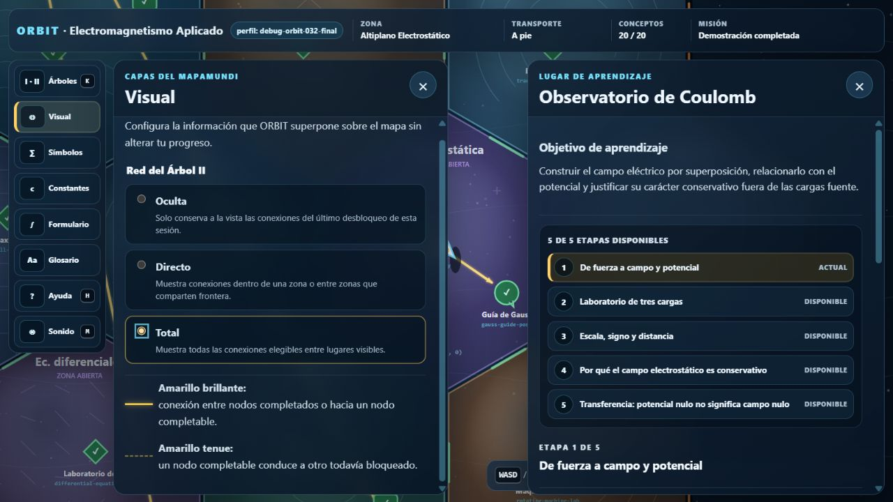

# Atlas de Electromagnetismo Aplicado



Prototipo abierto de un curso complementario de electromagnetismo aplicado con una interfaz narrativa en dos dimensiones. El estudiante explora libremente un mundo abstracto dividido en hexágonos, resuelve actividades universitarias y abre nuevas regiones mediante conocimiento adquirido.

El proyecto está dirigido a estudiantes que ya manejan cálculo, álgebra lineal y física clásica, especialmente quienes consideran estudiar Ingeniería Eléctrica o comienzan los primeros semestres de la especialidad.

> **Estado:** prototipo técnico y pedagógico `0.2.0`. El contenido científico sigue siendo provisional y no sustituye un curso formal ni una guía de ejercicios revisada.

## Qué demuestra esta versión

- Movimiento continuo en 2D con teclado; el personaje no está restringido a nodos ni caminos.
- Mundo de 19 hexágonos: Campamento Base, seis fundamentos y doce áreas de aplicación.
- **Árbol del conocimiento I:** abre zonas completas.
- **Árbol del conocimiento II:** revela lugares, gadgets, transportes, personajes y misiones dentro de zonas ya accesibles.
- Regla de fronteras: cuando se abre un hexágono, quedan transitables todas sus aristas compartidas con hexágonos previamente abiertos.
- Veinte conceptos y 27 lugares alcanzables, incluida una misión integradora Tierra–Luna.
- Ejercicios de alternativa, respuesta numérica con tolerancia y actividades de confirmación.
- Persistencia local por perfiles, exportación e importación JSON.
- Debugger visual y API de consola.
- Ambiente global y efectos para cambio de zona e inicio de misión, con mute y pruebas directas.
- Ecuaciones TeX renderizadas localmente con KaTeX y salida visual + MathML.
- Migración automática de perfiles `v1` al esquema `v2`.
- Validación automática contra bloqueos lógicos de progresión.
- Build estático y despliegue preparado para GitHub Pages.
- Una dependencia npm fijada y documentada: KaTeX 0.18.1; el sitio construido no usa CDN ni backend.

## Inicio rápido

Requisito: [Node.js](https://nodejs.org/) 24 LTS o posterior.

```bash
git clone https://github.com/JoaquinDiazM/ATLAS.git
cd ATLAS
npm install
npm run dev
```

Abre la URL exacta que imprime la terminal; normalmente será:

```text
http://127.0.0.1:4173/
```

`npm install` prepara el render matemático local. Los estudiantes que reciben el contenido ya construido no necesitan instalar nada.

### PowerShell y Visual Studio Code

El proyecto funciona de forma nativa en la terminal PowerShell de VSC. Si PowerShell bloquea `npm.ps1`, habilita scripts locales firmados para tu usuario y abre una terminal nueva:

```powershell
Get-ExecutionPolicy -List
Set-ExecutionPolicy -Scope CurrentUser RemoteSigned
```

Como alternativa puntual, `npm.cmd` evita el wrapper de PowerShell. Si el puerto 4173 está ocupado, `npm run dev` prueba automáticamente los puertos siguientes y muestra con claridad la URL del servidor nuevo. Abre esa URL, no una pestaña antigua que conserve otro puerto.

Después de actualizar el repositorio, detén cualquier servidor anterior con `Ctrl+C` y vuelve a iniciarlo. Para exigir un puerto específico:

```powershell
$env:PORT = 4200
npm run dev
```

Para una sesión de pruebas separada del progreso normal, usa el puerto indicado por la terminal:

```text
http://127.0.0.1:<puerto>/?debug=1&profile=debug
```

## Controles

| Control | Acción |
|---|---|
| `WASD` o flechas | Movimiento libre |
| `E` o espacio | Interactuar con el lugar cercano |
| Rueda del ratón | Zoom |
| `G` | Activar o desactivar el Lente de campo, una vez adquirido |
| `T` | Alternar transportes adquiridos |
| `M` | Activar o silenciar ambiente y efectos |
| `K` | Ver los dos árboles de progresión |
| `H` | Ver ayuda |
| `F2` o `` ` `` | Abrir/cerrar el debugger |
| `Esc` | Cerrar el panel superior |
| `Shift` + clic | Teletransportarse con el debugger activo |

## Comandos del repositorio

```bash
npm run dev       # servidor local; parte en 4173 y evita puertos ocupados
npm run validate  # referencias, coordenadas y alcanzabilidad del contenido
npm test          # pruebas con node:test
npm run build     # crea dist/
npm run repo-check # sintaxis, enlaces y dependencias respaldadas por ADR
npm run check     # validate + test + repo-check + build
```

Antes de hacer un commit, ejecuta:

```bash
npm run check
```

## Arquitectura conceptual

El mundo físico y el currículo son capas relacionadas, pero no equivalentes:

```text
movimiento continuo del personaje
             │
             ▼
hexágonos abiertos ───── Árbol I ───── conceptos adquiridos
             │
             ▼
lugares dentro de la zona ─ Árbol II ─ prerrequisitos y recompensas
```

El estado persistido contiene logros y preferencias. Las zonas y lugares disponibles se **derivan** desde ese estado; no se guardan como una segunda verdad que pueda quedar inconsistente.

Más detalles:

- [Arquitectura](docs/ARCHITECTURE.md)
- [Diseño del mundo y los dos grafos](docs/WORLD_AND_KNOWLEDGE_DESIGN.md)
- [Principios pedagógicos](docs/PEDAGOGICAL_PRINCIPLES.md)
- [Esqueleto curricular preliminar](docs/CURRICULUM_SKELETON.md)
- [Autoría de contenido](docs/CONTENT_AUTHORING.md)
- [Debugger](docs/DEBUGGING.md)
- [Informe de validación](docs/VALIDATION_REPORT.md)

## Estructura del repositorio

```text
.
├── AGENTS.md                 # reglas globales para agentes y colaboradores
├── index.html                # interfaz DOM y Canvas
├── src/
│   ├── core/                 # geometría, progreso, ejercicios y validación
│   ├── data/                 # definición declarativa de mundo y contenido
│   ├── game/                 # loop, cámara, entrada y renderer Canvas
│   ├── audio/                # carga local, ambiente, efectos y mute
│   └── ui/                   # paneles, ejercicios, HUD y debugger
├── tests/                    # pruebas unitarias y de progresión
├── scripts/                  # servidor, build y validador
├── docs/                     # diseño, decisiones y guías
├── public/                   # favicon y manifiesto
└── .github/workflows/        # validación remota y publicación opcional en Pages
```

## Debugger

La interfaz de depuración permite:

- ignorar fronteras bloqueadas;
- mostrar IDs, coordenadas y relaciones de los grafos;
- teletransportar al personaje;
- completar el lugar cercano;
- conceder el siguiente concepto;
- abrir todas las zonas;
- completar todo el prototipo;
- probar directamente los tres recursos de audio;
- reiniciar, exportar e importar un perfil.

También existe una API en consola:

```js
AtlasDebug.help();
AtlasDebug.snapshot();
AtlasDebug.grantNextConcept();
AtlasDebug.teleportArea("waves");
AtlasDebug.setNoclip(true);
```

Consulta [docs/DEBUGGING.md](docs/DEBUGGING.md) para la referencia completa.

## Publicación en GitHub Pages

Cada push a `main` ejecuta instalación reproducible, validación, pruebas y build sin publicar el repositorio privado. Para activar Pages explícitamente:

1. En GitHub, abre **Settings → Pages**.
2. En **Build and deployment**, selecciona **GitHub Actions**.
3. En **Settings → Secrets and variables → Actions → Variables**, crea `ENABLE_PAGES` con valor `true`.
4. Vuelve a ejecutar el workflow o realiza un nuevo push; entonces publicará `dist/`.

No definas esa variable mientras quieras conservar el proyecto únicamente como repositorio privado sin sitio público.

Todas las rutas del prototipo son relativas, por lo que funciona tanto en `usuario.github.io` como en `usuario.github.io/nombre-del-repositorio/`.

## Contribuciones y uso de agentes

Lee primero:

- [AGENTS.md](AGENTS.md)
- [CONTRIBUTING.md](CONTRIBUTING.md)
- [docs/CODEX_START_HERE.md](docs/CODEX_START_HERE.md)
- [docs/CODEX_TASK_TEMPLATE.md](docs/CODEX_TASK_TEMPLATE.md)

Las modificaciones grandes deben preservar los invariantes de progresión y acompañarse de pruebas. No se deben copiar evaluaciones, pautas o material docente protegido sin autorización explícita.

## Licencias

- Código fuente: [MIT](LICENSE).
- Contenido pedagógico original y documentación: [CC BY-SA 4.0](LICENSE-CONTENT.md), salvo indicación distinta.
- KaTeX: MIT, copiado al build desde la dependencia fijada.
- Audio incluido: CC0 1.0; procedencia en [public/assets/audio/ATTRIBUTION.md](public/assets/audio/ATTRIBUTION.md).
- Los enlaces externos conservan sus propias condiciones de uso; no se redistribuyen sus recursos dentro del repositorio.
